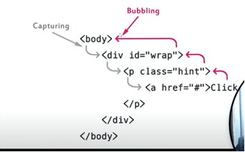

Event Bubbling, Capturing and Stop Propagation, Immediate Propagation & Prevent Default?
------------------------------------------------------------------------------------------

Event bubbling
-----------------
Event bubbling means propagation is done from child element to ancestor(parent) elements in the DOM.

Event capturing (Event Trickling)
-----------------------------------
Event capturing means propagation of event is done from ancestor(parent) elements to child element in the DOM

Example - 

Event bubbling Problem Statment - 
-----------------------------------

index.html
----------
        

                <button>click</button>
        

script.js-
---------
        let div = document.querySelector('div');
        let button = document.querySelector('button');
        div.addEventListener('click', function () {
        console.log('div');
        });
        button.addEventListener('click', function () {
        console.log('button');
        })

Console-
---------   
        button
        div

Event capturing Problem Statment -
---------------------------------

